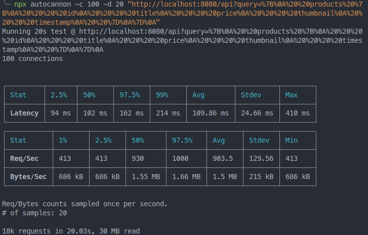
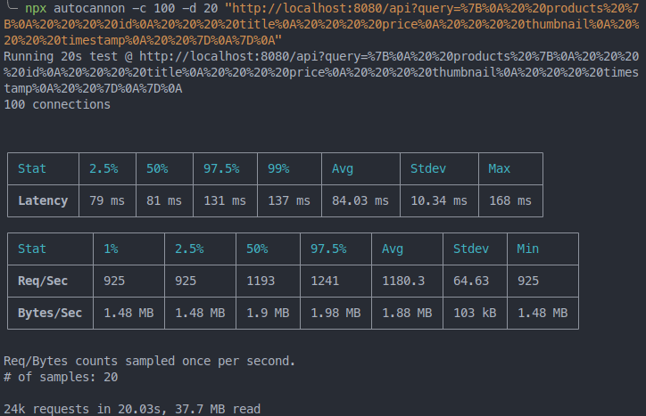
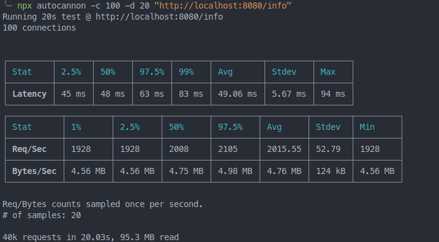
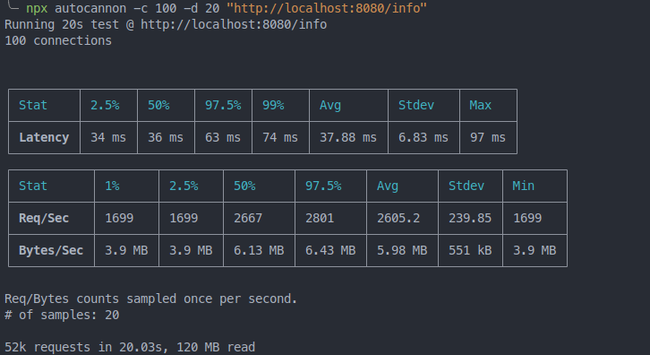

# Desafío 23 - Programación Backend

### CoderHouse

## REFORMAR PARA USAR OTRO FRAMEWORK (Koa)

Retomar el proyecto con el que vemos trabajando para trasladarlo a uno de los frameworks presentados

### Consigna

Elegir uno de los frameworks vistos en clase y trasladar a esta nueva plataforma el último proyecto entregable (con GraphQL) o al anterior (sin GraphQL).

Verificar el correcto funcionamiento del servidor a nivel de sus rutas, vistas, lógica de negocio y persistencia.

### Ejecución

Luego de clonar o descargar el repositorio e instalar todas las dependencias con `npm install`, existen dos comandos para levantar el proyecto.
Para levantarlo en modo de desarrollo junto a nodemon, utilizar `npm run dev`. De lo contrario, para ejecutarlo en "modo producción", utilizar `npm start`.

Se puede pasar por parámetros de argumento dos opciones:
| Opción | Valor | Defecto |
| ------ | ----------------------- | --------------------------------------------------------------------------------------------------------------------------------------------------------------------------------------------------------------------------- |
| `-p --port --PORT` | Número de puerto de escucha del servidor | 8080 |
| `-m --mode --MODE` | Módo de ejecución del servidor. `FORK` o `CLUSTER` | FORK |

Se puede seleccionar entre cuatro métodos de **persistencia de datos** a través de la variable de entorno `PERS`.

| Key             | Descripción                                               |
| --------------- | --------------------------------------------------------- |
| `mem`           | Persistencia en memoria del servidor (Opción por defecto) |
| `file`          | Persistencia usando el sistema de archivos                |
| `mongodb`       | Persistencia en base de datos MongoDB local               |
| `mongodb_atlas` | Persistencia en base de datos MongoDB Atlas               |

Esta selección se hace pasando el valor correspondiente de la key en la variable de entorno `PERS` a la hora de levantar el servidor.
La forma de hacerlo depende de la terminal que se esté ejecutando. Un ejemplo desde linux sería:

```sh
$ PERS=mongodb_atlas node .
```

### Vistas

Existen las siguientes vistas que proveen una manera amena de probar el desafío.
Estas vistas se encuentran en las rutas:

- **/** : es la vista principal en donde se encuentra el formulario de carga de productos y el centro de mensajes (chat). Utiliza **websockets**. Requiere autenticación.

- **/login** : formulario de login.

- **/login-error** : vista a la que redirige tras un error en el login.

- **/register** : formulario de registro.

- **/register-error** : vista a la que redirige tras un error en el login.

- **/logout** : vista a la que se accede tras hacer el logout y luego de 5 segundos redirige a home.

- **/productos-mock** : es donde se muestra en una tabla el mock de productos devueltos por la llamada a la API en la ruta de test. Requiere autenticación

- **/info**: muestra información relativa a la app

### API

Se montó la **API GraphQL** sobre la ruta `/api`.
En su router encontramos la definición del schema de graphql, como se muestra a continuación:

```js
// GraphQL schema
const schema = buildSchema(`
  type Query {
    products: [Product!]!
    product(id:ID!): Product!
    productsMock: [Product!]!
    randoms(cant: Int): [RandomPair!]!
  }
  type Mutation {
    createProduct(data: ProductCreateInput!): Product!
    updateProduct(id:ID!, data: ProductUpdateInput!): Product!
    deleteProduct(id: ID!): ID!
  }
  type Product {
    id: ID!
    title: String!
    price: Float!
    thumbnail: String!
    timestamp: String!
  }
  type RandomPair {
    number: String!
    occurrency: Int!
  }
  input ProductCreateInput {
    title: String!
    price: Float!
    thumbnail: String!
  }
  input ProductUpdateInput {
    title: String
    price: Float
    thumbnail: String
  }
`);
```

Cuando nos encontramos en el ambiente de **desarrollo**, en esta misma ruta se ofrece el IDE de **GraphiQL**, el cuál es muy útil para explorar la API y obtener documentación de la misma.

### Detalles y comentarios

Opté por migrar el proyecto al framework **Koa**.

Fue la capa de ruteo (servidor, routers,middlewares y controllers) la que sufrió los cambios, ya que el resto de las capas (servicio, modelo, presentación) son ajenas al framework en cuestión.

Debido a la característica minimalista de **Koa**, fue necesario instalar de manera separada cada middleware requerido para mantener las mismas funcionalidades que antes. Entre ellos se encuentran:

- koa-body
- koa-compress
- koa-ejs
- koa-graphql
- koa-passport
- koa-router
- koa-session
- koa-session-mongoose
- koa-static

A fin de no introducir cambios en como se pensó la API originalmente (según se fue pidiendo en algún desafío), mantuve la autenticación requerida sobre la misma para poder operar. Por lo que antes de llegar al middleware de `graphqlHTTP`, permanece el middleware `isAuthApi` que comprueba que nos encontremos autenticados. De no ser así se devuelve un mensaje de error indicando esto.  
Lo mismo con las rutas protegidas del web server en donde el middleware `isAuthWeb` está presente.

Por útlimo hice una prueba de stress en dos rutas del servidor **Koa** para verificar una de sus cualidades, que hace referencia a ser uno de los frameworks más rápidos del mercado.
Para ello comparé las mismas rutas con la misma lógica asociada, primero con **Express** y luego con **Koa**.
En ambos casos el servidor fue levantado usando el siguiente comando:

```bash
PERS=mongodb npm start
```

Los resultados son notables y muestran un rendimiento **30% superior** usando en framework **Koa** vs **Express**

Los resultados:

**Express** **GET** http://localhost:8080/api?query=%7B%0A%20%20products%20%7B%0A%20%20%20%20id%0A%20%20%20%20title%0A%20%20%20%20price%0A%20%20%20%20thumbnail%0A%20%20%20%20timestamp%0A%20%20%7D%0A%7D%0A

<div>
  
</div>
<br/>

**Koa** **GET** http://localhost:8080/api?query=%7B%0A%20%20products%20%7B%0A%20%20%20%20id%0A%20%20%20%20title%0A%20%20%20%20price%0A%20%20%20%20thumbnail%0A%20%20%20%20timestamp%0A%20%20%7D%0A%7D%0A

<div>
  
</div>
<br/>

**Express** **GET** http://localhost:8080/info

<div>
  
</div>
<br/>

**Koa** **GET** http://localhost:8080/info

<div>
  
</div>
<br/>
